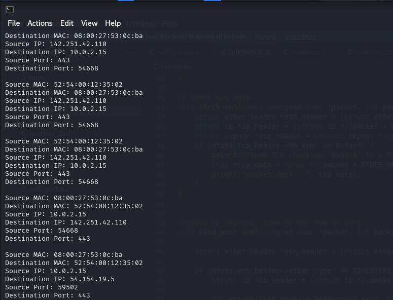
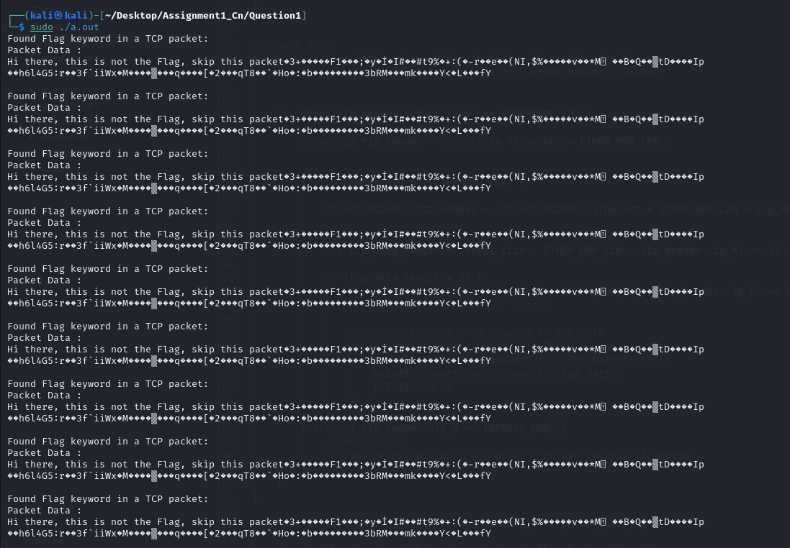
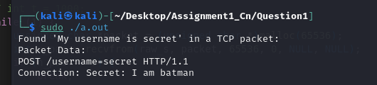
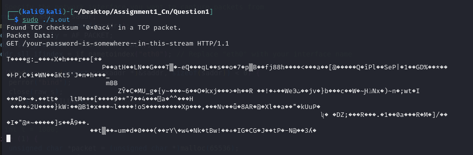

for question 1 :
(a)   sniff_packet have the code for formation of raw socket and packet receiving.
(b) The number of flows observed by your program and their 4-tuple.

total number of flows observed :- 
four tuple:-
 

2:-
(1) There is a Flag in a TCP Packet. Identify the flag. (Hint: Search for the keyword Flag)

(2) My username is secret, Identify my secret.

(3) I have a TCP checksum “0x0ac4”. I have instructions in my path.

(4) My device has an IP Address “131.144.126.118”. Sum of my connection ports will lead you to a person.

(5) I come from localhost, I requested a milkshake. Find my flavour.
